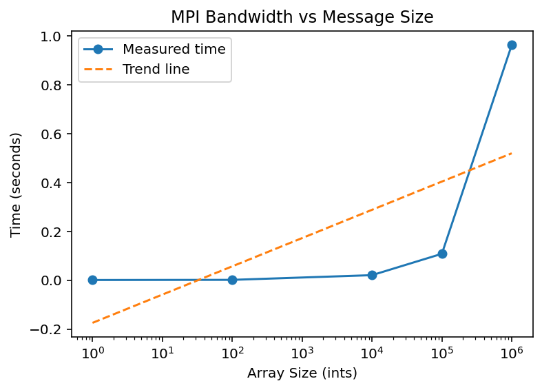

## MPI Communication Test

The program comm_test_mpi.c was compiled and run using different numbers of processes.

### Observations

For 2 processes, the behaviour is simple: rank 1 sends a value to rank 0, and rank 0 receives it.

For 4 and 8 processes, multiple ranks send data to rank 0. The order in which the "Sent" messages appear is not sequential and can vary between runs. For example, in the 8-process run, ranks 6, 3, 4, 5, and 7 printed before rank 1.

This shows that MPI processes execute independently and asynchronously. There is no guaranteed order for when each process runs or sends its message.

However, rank 0 still receives all messages correctly, showing that MPI communication works even if execution order is not predictable.

## Functionalise the code

The modified program was compiled and run again with multiple process counts (2, 4, and 8), and produced the same output as before, confirming that the refactoring did not change the behaviour of the program.

## MPI Send Variants

Different send functions were tested by modifying the communication code.

MPI_Send worked as expected and produced consistent results.

MPI_Ssend (synchronous send) also worked correctly but is a blocking operation, meaning the sender waits until the receiver is ready. This can make it slower but more predictable.

MPI_Isend (non-blocking send) required the use of MPI_Wait to ensure the message was completed. Without this, the program behaved incorrectly.

MPI_Rsend was not reliable and caused errors if the receive is not already posted.

## MPI Communication Timing

The program was executed using the terminal time command with multiple processes.

Example run with 4 processes:

real    0m0.445s 
user    0m0.112s 
sys     0m0.174s 

The results show that execution time is very short and remains relatively consistent across runs. Some variation is expected due to process scheduling and MPI communication overhead.

This demonstrates that MPI communication for small messages is fast, but timing measurements at this scale can vary slightly between runs.

## MPI Ping-Pong Results

| Pings | Elapsed Time (s) | Average Time per Ping (s) |
|------|------------------|---------------------------|
| 100  | 0.000226         | 0.000002                  |
| 1000 | 0.001144         | 0.000001                  |
| 10000| 0.008676         | 0.000001                  |
| 10000| 0.007672         | 0.000001                  |

## MPI Bandwidth Results

| Array Size (ints) | Elapsed Time (s) | Avg Time per Ping (s) |
|------------------|------------------|------------------------|
| 1                | 0.001017         | 0.000001               |
| 100              | 0.001634         | 0.000002               |
| 10000            | 0.020842         | 0.000021               |
| 100000           | 0.108329         | 0.000108               |
| 1000000          | 0.963248         | 0.000963               |

The bandwidth test was carried out by sending arrays of different sizes between two MPI processes.

The results show that as the size of the array increases, the communication time also increases. This is expected because larger messages take longer to transfer between processes.

For very small message sizes, the time is dominated by latency (fixed communication cost). As the message size grows, the effect of bandwidth becomes more significant, leading to a noticeable increase in communication time.

## Collective Communication Benchmark Results

| Method   | Input Size | Real Time (s) | User Time (s) | Sys Time (s) |
|----------|-----------|---------------|---------------|--------------|
| DIY      | 100000    | 0.444         | 0.126         | 0.165        |
| Bcast    | 100000    | 0.445         | 0.144         | 0.159        |
| Scatter  | 100000    | 0.424         | 0.151         | 0.125        |

## Send/Recv vs Gather vs Reduce Benchmark

| Method   | Input Size | Real Time (s) | User Time (s) | Sys Time (s) |
|----------|-----------|---------------|---------------|--------------|
| DIY      | 100000    | 0.415         | 0.123         | 0.162        |
| Gather   | 100000    | 0.434         | 0.113         | 0.173        |
| Reduce   | 100000    | 0.432         | 0.150         | 0.143        |

The results show that all three methods perform similarly for this problem size. The DIY (manual send/receive) approach is slightly faster in this case, while MPI_Gather and MPI_Reduce show similar performance.

This is expected because the workload is relatively small, meaning communication overhead dominates and reduces the advantage of optimized collective operations.
